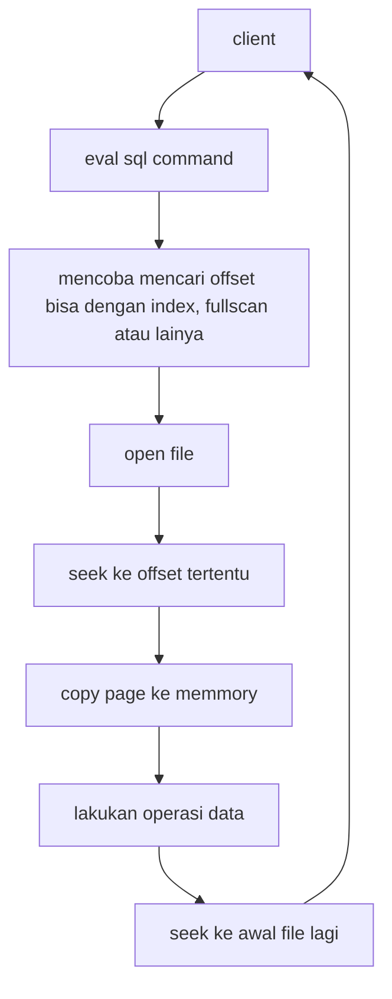

import GiscusComponent from '../../website/src/components/GiscusComponent';

# Bagaimana Database Engine Bekerja

Halo pembaca, berjumpa pada part 1 series `Membangun Database Engine`, fokus pada part pertama ini adalah
membahas sebenarnya bagaimana database itu membaca dan menulis data, referensi yang akan digunakan adalah
dari database database populer, namun karena banyak sekali database di luar sana maka penulis memutuskan memilih
referensi dari Postgree SQL.

## Storage Engine

Postgree SQL menggunakan Page File dengan block di dalamnya, karena database di rancang untuk emnyimpan data
yang besar maka untuk `Storage Engine` harus se efisien mungkin, sebenarnya ada beberapa pendekatan lain
yang digunakan database lain juga, namun pengganan page file ini lebih hemat operasi `I/O` (Input / Output).
I/O sangat diperhatikan disini untuk meminimalisir overhead.

## Proses Menulis dan Membaca
Postgree menggunakan file untuk menyimpan suatu table data, menggunakan page file dan block di dalam nya
secara default maximum size untuk Page file adah 8kb dan setiap block default nya berukuran 1GB
row akan disimpan di dalam block, jikalau row tidak muat lagi maka akan di gunakan `TOAST` postgree
akan membuat pointer ke file TOAST. [Official Docs](https://www.postgresql.org/docs/current/storage-toast.html)

Untuk memahami lebih lanjut kita harus mengingat istilah istilah berikut.

    - `Row`     : unit terkecil berada di dalam page
    - `Page`    : berisi metadata dan juga banyak row tuple berukuran default 8kb
    - `Block`   : berisi banyak Page ukuran maksimal default 1GB

Coba kita perhatikan berikut adalah ilustrasi proses menulis data, ilustrasi dibawah tidak mendetail tapi setidaknya kita bisa memahami
yang terjadi

Pada statement `SELECT * FROM tbl OFFSET 1000 LIMIT 5` kita ingin mengambil 5 row setelah offset ke 1000
pada page file kita bisa membuka i/o baca file lalu mencoba melakukan `seek`, seek akan
memindahkan pointer pada file ke offset yang kita inginkan, namun bukan berarti ini offset ke 1000
processnya masih komplek, namun untuk mempermudah sekarang anggap 1000 itu adalah offset di byte ke 1000, lalu
`page` akan di copy ke memmory buffer untuk di process, kita mengambil cukup 5 row data.

Detail Postgree memiliki format Page seperti berikut berdasarkan dokumentasi resmi:

Process seek dan penggunaan pendekatan yang primitif dekat ke sistem operasi dan file system
ini membuat sistem storage engine database lebih efisien, tentu saja yang kita bahas diatas
adalah baru hanya kulitnya saja, setidaknya sebelum menuju part selanjutnya kita akan memahami
bagaimana database bisa menulis dan membaca data.

## Bagaimana kalau ingin mencari data ??
Indeks adalah senjata untuk mempercepat process pencarian dan pelokasian data atau page, kebanyakan database
menggunakan B-tree atau b+tree namu tentu masih banyak yang menggunakan lain, intinya adalah penggunaan
struktur data lain yang lebih efisien untuk process pelokasian suatu data lalu mengambil data asli
pada block data.

## Penutup Part 1
Jadi ada dua hal utama yang kita bahas pada part 1 ini yaitu bagaimana database menulis, membaca
dan menyimpan data, dan bagaimana index berperan penting dalam mempercepat process
pelokasian data, dua hal diatas adalah yang akan kita jadikan core dari sistem database
yang akan kita bangun pada series ini, tentu saja jika ada part yang kurang kamu
bisa kontribusi ke artikel ini melalui link github pada pojok kanan atas.

Untuk semakin memahami bagaimana block dan page ini efisien kita akan mencoba membuat
program untuk emulate process menulis dan membaca data menggunakan block dan page pada
artike selanjutnya

 

> Sampai jumpa di artikel selanjutnya
>
> — Penulis

<GiscusComponent />

