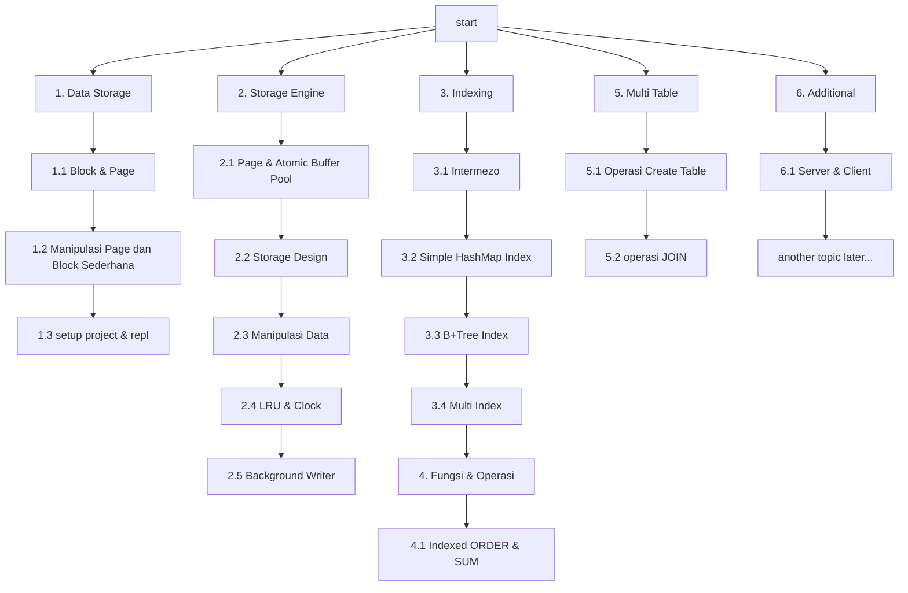

# Pendahuluan & Roadmap Membangun Database Engine

Halo guys pada series pertama ini kita akan coba membangun sebuat database engine yang memiliki fungsi
seperti database database yang sering kita pakai sehari hari seperti mysql, postgree, sqlite, untuk note
yang akan kita bangun adalah relational database.

Yang akan kita bangun tentu tidak akan sesempurna database populer dan tidak sesederhana menulis ke file, kita akan coba
petakan pembelajaran kita kedepanya kita akan meniru harl yang sering kita gunakan pada database populer, mari kita lihat
pada roadmap dibawah

:::warning
Disclaimer: series ini tidak bertujuan untuk membuat database engine yang digunakan untuk Production grade,
namun difunakan untuk pembelajaran baik bagi penulis dan pembaca dari keilmuan computer science dari sebuah database sistem
:::

## Road Map



## Bahasa
:::tip
Pada series ini bahasa yang utama digunakan adalah Go (language) dengan alasan lebih banyak standart
library yang support ke hal hal primitive dan mudah untuk di pelajari dan di jalankan,
namun tidak menutup kemungkinan untuk menggunakan bahasa lain, lagi lagi bahasa bukanlah barier utama.
pada blog ini dibuka kontribusi untuk membuat versi bahasa lain, jika kamu sedang mempelajari bahasa baru
atau kamu mau berkontribusi membuat veri dengan bahasa lain fell free untuk kontribusi klik
repository link berikut [Kontribusi](https://github.com/alfiankan/rebuild-and-learn-blog)

Contoh tampilan code dalam series ini seperti berikut:

import Tabs from '@theme/Tabs';
import TabItem from '@theme/TabItem';
import GiscusComponent from '../../website/src/components/GiscusComponent';


<Tabs>
  <TabItem value="go" label="Go" default>
    ```go showLineNumbers
    package main

    func main() {
        
    }
    ```
  </TabItem>
  <TabItem value="python" label="Python">
    ```python showLineNumbers
    print("hello")
    a = 90 + 9
    ```
  </TabItem>
  <TabItem value="Ruby" label="Ruby">
    ```ruby showLineNumbers
    puts "Hello World!"
    ```
  </TabItem>
</Tabs>
:::

## Repositori Sumber
Semua code pada series ini akan di simpan pada [repositori ini](https://github.com/alfiankan/nano-db)

## Play Ground
Pada series ini akan di sediakan link menuju [Go Playground](https://go.dev/play/) untuk mecoba code secara ondemand

<br/>

> Selamat Mengikuti Series Ini 
>
> — Penulis

<GiscusComponent />
