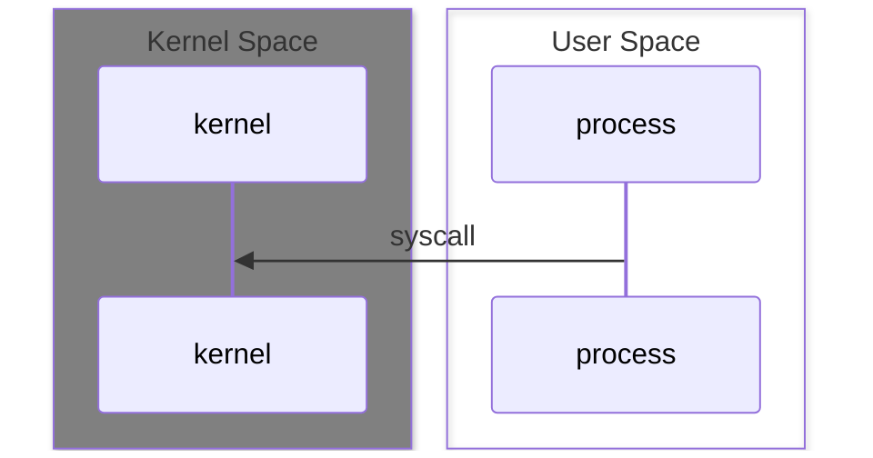

# Database Block dan Page

import UpdateDelete from '../../../website/static/img/updatedelete.gif';


Halo pembaca, berjumpa pada bagian pertama dari series `Membangun Database Engine`, kita akan mencoba mempelajari dan
recall tentang dasar penyimpanan data.

:::info
1. Unit Ukuran Penyimpanan
2. Sistem Operasi Membaca dan Menulis
3. Kontrol Penuh Pada Disk
4. Block dan Page
5. Membuat Program Manipulasi Page Sederhana
:::

import WernerBuchholz from '../../../website/static/img/werner-buchholz.jpeg';
import BufferIlustration from '../../../website/static/img/buffer.gif';
import ODirect from '../../../website/static/img/o_direct.gif';
import PageRead from '../../../website/static/img/read.gif';


import BinaryToDecimal from '../../../website/src/components/BinaryToDecimal';


## Unit Ukuran Penyimpanan
Dalam series ini kita akan sering berurusan dengan unit ukuran penyimpanan data, pada sistem database, sebisa mungkin
database akan mengamibl control secara penuh proses manipulasi baca dan tulis ke `I/O` (Input / Output) device
khususnya `storage device`, kita tidak akan terlalu dalam hal ini, yang akan kita coba recall adalah unit ukuran byte.

:::info


Bitte ein Byte! [*Werner Buchholz*](https://www.computer.org/profiles/werner-buchholz) seorang German-American computer scientist yang mencetuskan ukuran byte, ukuran ini
ada dalam Institute of Electrical and Electronics Engineers (IEEE), yaitu sequence dari 8 bit data, byte sangat
populer digunakan dan dikonversikan ke MB, KB, GB dan yang lainya
:::


Pada contoh di bawah ini cobalah untuk melihat persamaan dari decimal dan binary dengan menggeser range dibawah.


:::info

<BinaryToDecimal />
:::

Lalu kita akan recall untuk konversi ke ukuran lebih besar, karena berbasis biner maka kita bisa pangkatkan `2` dengan `10` (decimal base 10)
Sehingga `1 KB` adalah `1024 Bytes`

```python {4} showLineNumbers
Python 3.10.6 (main, Jan 17 2024, 13:06:31) [Clang 15.0.0 (clang-1500.0.40.1)] on darwin
Type "help", "copyright", "credits" or "license" for more information.
>>> 2 ** 10
1024
>>>
```

Selanjutnya coba kita perhatikan konversi di bawah, anda dapat menggunakan ini untuk sepanjang series ini karena akan sering berurusan dengan unit ini.

```bash
1 Bytes = 8 Bit

1 KB = 1024 Bytes (2 ** 10) (1024 * 8 = 8192 Bit)

1 MB = 1024 KB (10240 Bytes)
```


## Sistem Operasi Membaca dan Menulis

Selanjutnya kita harus juga mengetahui secara garis besar minimal bagaimana sistem operasi mengelola `I/O` terutama `Disk`, namun tanpa terlalu melebar
yang akan kita coba pahami adalah spesifik ke `Baca/Tulis File` dan `Buffer`.

Membaca dan Menulis ke `I/O Disk` adalah operasi mahal terutama jika masih menggunakan teknologi lama seperti `HDD (motorized)` .etc, kita coba perhatikan
piramida gambar dibawah kecepatan storage device. (semakin tinggi angka (Kecepatan/ukuran) semakin jelek)


| Rangking Kecepatan   |      Device      |  Rangking Ukuran | Contoh |
|----------|:-------------:|------:|------:|
| 1 |  CPU Register | 4 |CPU Register|
| 2 |    SRAM   |   3 |Cpu Cache L1, L2, .etc|
| 3 | DRAM |    2 |RAM|
| 4 | Secondary Storage | 1 |HDD, SSD|


Untuk mengurangi `overhead` dalam baca tulis ke `Secondary Storage` kebanyakan sistem operasi (terutama yang jadi pembahasan dalam series ini (Linux dan Unix))
memiliki sistem `Buffer`, buffer ini seperti cache yang duduk di tengah process dan storage. Sistem Operasi secara pintar
akan mengatur bagaimana sebuah process akan membaca dari buffer dan memuat data dari `Disk` ke buffer, serta juga mekanisme
untuk `sync` atau `flush` Buffer ke disk kembali.


Buffer biasanya berada pada kernel memory yakni 'RAM' yang pada tabel di atas relatif memiliki performa lebih cepat dibanding penyimpanan yang lain namun memang terbatas pada ukuran penyimpanan, maka dari itu sistem operasi memiliki
mekanisme pintar untuk mengelola ini.

Namun hal ini menjadi dapat menjadi permasalahan pada aplikasi yang melakukan proses lebih banyak pada `I/O`, karena proses
sistem operasi dalam melakukan `sync/flush` tidak terlihat dengan jelas, namun beberapa database yang tetap memanfaatkan buffer dari sisi sistem operasi telah memiliki mekanisme untuk menangani ini, untuk menggunakan buffer dari sistem operasi kita bisa menggunakan syscall `mmap`.

:::info
`*syscall*` atau System Call adalah mekanisme memanggil layanan dari sistem operasi secara programatic. Ada banyak sekali `syscall`
pada beberapa sistem operasi yang berbeda, beberapa sistem operasi memiliki syscall yang sama yang mana menggunakan standar `POSIX` (Portable Operating System Interface).


:::

Beberapa database memanfaatkan `mmap` dan menggunakan syscall lain untuk mengatasi keterbatasan kontrol ke os buffer, salah satu artikel yang menarik dalam pembahasan `mmap` dapat [dibaca disini](https://db.cs.cmu.edu/papers/2022/cidr2022-p13-crotty.pdf). Beberapa database yang menggunakan `mmap` contohnya `mongodb` dan `influx`.

Beberapa syscall yang digunakan oleh database yang menggunakan `mmap`:
- [mmap](https://man7.org/linux/man-pages/man2/mmap.2.html) map buffer
- [munmap](https://man7.org/linux/man-pages/man3/munmap.3p.html) menghapus map buffer
- [madvise](https://man7.org/linux/man-pages/man2/madvise.2.html) memberikan arahan ke kernel untuk melakukan sesuatu pada range address tertentu


## Kontrol Penuh Pada Disk
Database membutuhkan kecepatan yang tinggi untuk melakukan pemrosesan data, maka banyak database yang menggunakan proses alokasi buffer dengan kontrolnya sendiri daripada mengandalkan sistem operasi untuk melakukan alokasi sehingga dapat menentukan
kapan data di-load ke buffer, kapan dibaca dan tulis, kapan flush ke disk persistence dan optimasi lainnya.

Pada beberapa sistem operasi (khususnya Linux dan Unix) kita dapat langsung membaca ke disk tanpa menggunakan buffer dengan menggunakan flag syscall `O_DIRECT` saat membaca file, sehingga meminimalisir penggunaan cache pada sistem operasi.


## Block dan Page
Block adalah
Block dan Page dapat kita gunakan untuk meniru sistem operasi page, dengan membuat fixed size page dan menyatukanya dalam suatu file
yang disebut block dan akan kita sebut sebagai Heap File, ada beberapa implementasi pada series ini kita akan emnggunakan struktur directory, karena
pada series ini menggunakan referensi arsitektur dan desain dari PostgreeSQL.

Contohnya pada PostgreeSQL ukuran default page adalah `4096 KB` dan block size maksimal default `1 GB`. karena page berukuran fixed, kita dapat langsung
mengetahui lokasi suatu page dengan/dari offset bytes nya (offset byte adalah lokasi pointer dalam membaca dan menulis file).

contohnya kita ingin membaca page ke 2 maka cukup dengan.

```bash
4096 * 2 = 8192

```

maka kita bisa lakukan seek dan read.

```c++
open()
seek(8192)
read()
seek(0)
```


import Tabs from '@theme/Tabs';
import TabItem from '@theme/TabItem';

:::info
Untuk Source Code lengkap dari tulisan ini dapat pembaca kunjungi pada link berikut
[nano-db-chapter-01](https://github.com/rebuild-and-learn/nano-db-from-scratch-contrib-go/tree/chapter-01/page-and-block)
:::

<Tabs>
  <TabItem value="go" label="Go" default>
    ```go showLineNumbers
    func (self *Pager) ReadFD(offset int64, limit int64) ([]byte, error) {

    	byteData := make([]byte, limit)

    	if _, err := syscall.Seek(self.fd, offset, io.SeekCurrent); err != nil {
    		return nil, err
    	}

    	if _, err := syscall.Read(self.fd, byteData); err != nil {
    		return nil, err
    	}

    	if _, err := syscall.Seek(self.fd, io.SeekStart, io.SeekStart); err != nil {
    		return nil, err
    	}

    	return byteData, nil
    }
    ```
  </TabItem>
  <TabItem value="c" label="C">
    ```c showLineNumbers
    ```
  </TabItem>
</Tabs>


## Membuat Program Manipulasi Page Sederhana

Kita akan mencoba implementasi apa yang sudah kita baca diatas dengan membuat sistem penyimpanan data sederhana yang bisa
menambahkan data, membaca data, mengupdate data dan menghapus data.

pertama kita akan coba tentukan dahulu beberapa constant ukuran yang akan kita gunakan, karena kita akan menggunakan Heap File dan
akan menggunakan fixed size.

<Tabs>
  <TabItem value="go" label="Go" default>
    ```go showLineNumbers
    // in bytes
    const (
    	PAGE_SIZE        = 1024      // 1 kb
    	MAX_TUPLE_SIZE   = 100       // 100 bytes
    	PAGE_HEADER_SIZE = 8         // for uint64
    )
    ```
  </TabItem>
  <TabItem value="c" label="C">
    ```c showLineNumbers
    ```
  </TabItem>
</Tabs>


Kita menentukan bahwa kita akan emnggunakan ukuran `1 KB` atau `1024 Bytes`, pada setiap page kita akan alokasikan `8 Bytes` untuk
menyimpan berapa total row (int64) yang akan ada di dalam page, lalu kita juga tentukan untuk fixed size row tuple kita, karena untuk
mempermudah percobaan pertama ini kita gunakan ukuran yang pasti yaitu sebesar `100 bytes`.

```bash
     |--------  |total row (8 bytes)|
     |          |100 bytes          |
     |          |100 bytes          |
    1KB         |100 bytes          |
     |          |100 bytes          |
     |          |100 bytes          |
     |          |100 bytes          |
     |          |100 bytes          |
     |          |100 bytes          |
     |          |100 bytes          |
     |--------  |100 bytes          |

     |--------  |total row (8 bytes)|
     |          |100 bytes          |
     |          |100 bytes          |
    1KB         |100 bytes          |
     |          |100 bytes          |
     |          |100 bytes          |
     |          |100 bytes          |
     |          |100 bytes          |
     |          |100 bytes          |
     |          |100 bytes          |
     |--------  |100 bytes          |

     |--------  |total row (8 bytes)|
     |          |100 bytes          |
     |          |100 bytes          |
    1KB         |100 bytes          |
     |          |100 bytes          |
     |          |100 bytes          |
     |          |100 bytes          |
     |          |100 bytes          |
     |          |100 bytes          |
     |          |100 bytes          |
     |--------  |100 bytes          |

Space terpakai (10 row) = 8 + 1000 = 1008 Bytes
Sisa Space (Hole) = 1024 - 1008 = 16 Bytes

```


Pertama kita siapkan beberapa fungsi/method untuk membaca dan menulis serta helper.

:::info
Untuk Source Code lengkap dari tulisan ini dapat pembaca kunjungi pada link berikut
[nano-db-chapter-01](https://github.com/rebuild-and-learn/nano-db-from-scratch-contrib-go/tree/chapter-01/page-and-block)
:::

<Tabs>
  <TabItem value="go" label="Go" default>
    ```go showLineNumbers
    type Pager struct {
    	blockpath string
    	fd        int
    }

    func NewPager(blockPath string) *Pager {
            /* disini kita akan membuat struct object dan
             * dan menyimpan file descriptor dari file yang kita open
             * kita guanakan flag O_DIRECT (0x4000) untuk ememinimalisir kernel cache (bypass)
             * dan O_RDWR untuk bisa baca tulis
             */
    	fd, err := syscall.Open(blockPath, 0x4000|syscall.O_RDWR, 0664)
    	if err != nil {
    		panic(err)
    	}

    	return &Pager{
    		blockpath: blockPath,
    		fd:        fd,
    	}
    }

    func (self *Pager) ReadFD(offset int64, limit int64) ([]byte, error) {
            /* disini kita akan membaca bytes file dari offset yang kita inginkan
             * kita gunakan seek() untuk memindahkan poiter lalu membacanya
             * dengan seek kita tidak perlu baca file dari awal ke akhir contohnya juka file terlalu besar
             */
    	byteData := make([]byte, limit)

    	if _, err := syscall.Seek(self.fd, offset, io.SeekCurrent); err != nil {
    		return nil, err
    	}

    	if _, err := syscall.Read(self.fd, byteData); err != nil {
    		return nil, err
    	}

            // reset pointer ke awal
    	if _, err := syscall.Seek(self.fd, io.SeekStart, io.SeekStart); err != nil {
    		return nil, err
    	}

    	return byteData, nil
    }

    func (self *Pager) Rewrite(offset int64, data []byte) error {
            /* disini kita akan menulis bytes file dari offset yang kita inginkan
             * kita gunakan seek() untuk memindahkan poiter lalu menulis datanya
             */
    	if _, err := syscall.Seek(self.fd, offset, io.SeekCurrent); err != nil {
    		return err
    	}

    	if _, err := syscall.Write(self.fd, data); err != nil {
    		return err
    	}
            // reset pointer ke awal
    	if _, err := syscall.Seek(self.fd, io.SeekStart, io.SeekStart); err != nil {
    		return err
    	}

    	return nil
    }

    func (self *Pager) GetLastPageStartOffset() (int64, error) {
            /* untuk mendapatkan page offset start terakir cukup mudah
             * kita cukup dapatkan ukuran file dan kita kuragi dengan ukuran page nya
             */
    	st := syscall.Stat_t{}
    	if err := syscall.Stat(self.blockpath, &st); err != nil {
    		return -1, err
    	}

    	return st.Size - PAGE_SIZE, nil
    }

    ```
  </TabItem>
  <TabItem value="c" label="C">
    ```c showLineNumbers
    ```
  </TabItem>
</Tabs>


### REPL (Read Evaluate Print Loop)
Untuk menggunakan program yang kita buat kita akan membuat interface berupa REPL Sederhana mirip mirip dengan cli pada
database lain. REPL kita sesimple akan parsing input dan menentukan apa yang akan dilakukan oleh
pager.

:::info
Untuk Source Code lengkap dari tulisan ini dapat pembaca kunjungi pada link berikut
[nano-db-chapter-01](https://github.com/rebuild-and-learn/nano-db-from-scratch-contrib-go/tree/chapter-01/page-and-block)
:::

<Tabs>
  <TabItem value="go" label="Go" default>
    ```go showLineNumbers
    package main

    import (
    	"bufio"
    	"fmt"
    	"os"
    	"strconv"
    	"strings"
    	"time"
    )

    func main() {

    	pager := NewPager("hello")

    	fmt.Print("nano-db >> ")
    	scanner := bufio.NewScanner(os.Stdin)

    	for scanner.Scan() {
    		input := scanner.Text()

    		switch strings.ToUpper(strings.Split(input, " ")[0]) {
    		case "INIT":
    			f, _ := os.OpenFile("hello", os.O_WRONLY, 0664)
    			f.Write(make([]byte, PAGE_SIZE))
    			f.Sync()
    			f.Close()

    		case "INSERT":

    			data := strings.Split(input, " ")[1]
    			n, _ := strconv.Atoi(strings.Split(input, " ")[2])

    			for x := 0; x < n; x++ {

    				id := strconv.Itoa(time.Now().Nanosecond())

    				err := pager.InsertRowData([]byte(fmt.Sprintf("%s) %s", id, data)))
    				if err != nil {
    					fmt.Println(err)
    				}
    			}
    			break
    		case "FROM":
    			offset, _ := strconv.Atoi(strings.Split(input, " ")[1])
    			limit, _ := strconv.Atoi(strings.Split(input, " ")[2])

    			pager.ReadPages(int64(offset), int64(limit))

    			break
    		case "UPDATE":
    			pageOffset, _ := strconv.Atoi(strings.Split(input, " ")[1])
    			nRow, _ := strconv.Atoi(strings.Split(input, " ")[2])
    			newRow := strings.Split(input, " ")[3]

    			pager.UpdateRowData(int64(pageOffset), int64(nRow), []byte(newRow))

    			break
    		case "DELETE":

    			pageOffset, _ := strconv.Atoi(strings.Split(input, " ")[1])
    			nRow, _ := strconv.Atoi(strings.Split(input, " ")[2])

    			pager.UpdateRowData(int64(pageOffset), int64(nRow), make([]byte, MAX_TUPLE_SIZE))

    			break
    		default:
    			fmt.Println("~")
    			break
    		}

    		fmt.Print("nano-db >> ")
    	}
    }

    ```
  </TabItem>
  <TabItem value="c" label="C">
    ```c showLineNumbers
    ```
  </TabItem>
</Tabs>


### Process Insert data

Process insert data ke dalam page cukup sederhana yaitu.

1. kita cek address (byte offset) dari page terakhir dari block (file), lalu kita copy ke memmory.
2. kita baca `8 Bytes` pertama dan kita decode menjadi int64 untuk mengetahui ada berapa row di dalam page.
3. kita coba cek apakah page masih muat untuk dimasukan satu row tuple lagi dengan perhitungan sederhana
    ```bash
    current_page_offset = 0
    total_row = 8

    sisa_space = 8 x 100 (ukuran fixed tuple row) + 8 (header) + 100 (ukuran tuple row) = 908
    1024 - 908 = 116
    karena masih 116 (bukan 0 atau negative) kita masih bisa memasukan ke page,
    jika tidak maka kita harus menambahkan page baru dan pindah
    ke page tersebut dan mengulang step diatas
    ```
4. Kita coba hitung dimana lokasi byte offset untuk menulis row baru dan menulis dari start offset tersebut
    ```bash
    (total_row x 100 ) + 8
    ```
5. tulis ulang ke block page yang sudah kita modifikasi.


import AddPage from '../../../website/static/img/add_page.gif';


Kode yang dapat kita tulis kurang lebih seperti dibawah beserta penjelasanya.

:::info
Untuk Source Code lengkap dari tulisan ini dapat pembaca kunjungi pada link berikut
[nano-db-chapter-01](https://github.com/rebuild-and-learn/nano-db-from-scratch-contrib-go/tree/chapter-01/page-and-block)
:::

<Tabs>
  <TabItem value="go" label="Go" default>
    ```go showLineNumbers
    func (self *Pager) InsertRowData(rowData []byte) error {
            // kita cek apakah data yang di masukan terlalu besar
    	if len(rowData) > MAX_TUPLE_SIZE {
    		return errors.New("MAX TUPLE SIZE")
    	}

            // kita cek pointer offset start unutuk page terakir
    	currentPagePointer, err := self.GetLastPageStartOffset()
    	if err != nil {
    		return err
    	}

            // kita baca page sesuai ukuran page dan copy ke memmory
    	currentPage, err := self.ReadFD(currentPagePointer, PAGE_SIZE)
    	if err != nil {
    		return err
    	}

    	var totalRowExist int64
    	binary.Read(bytes.NewReader(currentPage[0:PAGE_HEADER_SIZE]), binary.LittleEndian, &totalRowExist)

            // kita lakukan pengecekan apakah page masih muat untuk dimasukan row
            // jika tidak tambahkan page baru
    	if (totalRowExist*MAX_TUPLE_SIZE)+PAGE_HEADER_SIZE+MAX_TUPLE_SIZE > PAGE_SIZE {
    		currentPagePointer += PAGE_SIZE

    		if err := self.Rewrite(currentPagePointer, make([]byte, PAGE_SIZE)); err != nil {
    			return err
    		}

    		currentPage, err = self.ReadFD(currentPagePointer, PAGE_SIZE)
    		if err != nil {
    			return err
    		}
    		totalRowExist = 0
    	}

    	    // pad data to 100 bytes supaya fixed untuk percobaan ini
    	rowDataResized := make([]byte, 100)
    	for x := 0; x < len(rowDataResized); x++ {
    		rowDataResized[x] = byte('#')
    	}
    	for x := 0; x < len(rowData); x++ {
    		rowDataResized[x] = rowData[x]
    	}

            // kita coba kalkulasi lokasi offset untuk menuliskan row
    	availableRowPointer := int64(totalRowExist*MAX_TUPLE_SIZE) + PAGE_HEADER_SIZE

    	totalRowExist += 1
    	var headerInBytes bytes.Buffer
            // kita tambah counter row lalu ubah ke byte lagi (dibaca dari terkecil (little endian))
    	if err := binary.Write(&headerInBytes, binary.LittleEndian, totalRowExist); err != nil {
    		return err
    	}

            // copy 8 byte pertama ke page
    	copy(currentPage[0:PAGE_HEADER_SIZE], headerInBytes.Bytes())
            // copy row data ke page
    	copy(currentPage[availableRowPointer:int(availableRowPointer)+len(rowDataResized)], rowDataResized)

            // tulis ulang ke block
    	if err := self.Rewrite(currentPagePointer, currentPage); err != nil {
    		return err
    	}

    	return nil

    }

    ```
  </TabItem>
  <TabItem value="c" label="C">
    ```c showLineNumbers
    ```
  </TabItem>
</Tabs>


#### Testing

Kita coba cek page kosong pertama, karena kita mengacu dengan `Linux/Unix` kita gunakan hexdump. dibawah adalah `4096 Bytes` data (kita potong supaya lebih mudah dibaca)

```bash
~/workspace/nano-db-from-scratch-contrib-go on main !1                                                                                                              node system
> hexdump -v -C hello
00000000  00 00 00 00 00 00 00 00  00 00 00 00 00 00 00 00  |................|
00000010  00 00 00 00 00 00 00 00  00 00 00 00 00 00 00 00  |................|
00000020  00 00 00 00 00 00 00 00  00 00 00 00 00 00 00 00  |................|
00000030  00 00 00 00 00 00 00 00  00 00 00 00 00 00 00 00  |................|
00000040  00 00 00 00 00 00 00 00  00 00 00 00 00 00 00 00  |................|
00000050  00 00 00 00 00 00 00 00  00 00 00 00 00 00 00 00  |................|
00000060  00 00 00 00 00 00 00 00  00 00 00 00 00 00 00 00  |................|
00000070  00 00 00 00 00 00 00 00  00 00 00 00 00 00 00 00  |................|
00000080  00 00 00 00 00 00 00 00  00 00 00 00 00 00 00 00  |................|
00000090  00 00 00 00 00 00 00 00  00 00 00 00 00 00 00 00  |................|
000000a0  00 00 00 00 00 00 00 00  00 00 00 00 00 00 00 00  |................|
000000b0  00 00 00 00 00 00 00 00  00 00 00 00 00 00 00 00  |................|
000000c0  00 00 00 00 00 00 00 00  00 00 00 00 00 00 00 00  |................|
000000d0  00 00 00 00 00 00 00 00  00 00 00 00 00 00 00 00  |................|
000000e0  00 00 00 00 00 00 00 00  00 00 00 00 00 00 00 00  |................|
000000f0  00 00 00 00 00 00 00 00  00 00 00 00 00 00 00 00  |................|
00000100  00 00 00 00 00 00 00 00  00 00 00 00 00 00 00 00  |................|
00000110  00 00 00 00 00 00 00 00  00 00 00 00 00 00 00 00  |................|
00000120  00 00 00 00 00 00 00 00  00 00 00 00 00 00 00 00  |................|
00000130  00 00 00 00 00 00 00 00  00 00 00 00 00 00 00 00  |................|
```

Lalu coba kita jalankan program dan memasukan data.

```bash
~/workspace/nano-db-from-scratch-contrib-go on main !1                                                                                                              node system
> make run
go run ./...
nano-db >> INSERT rebuildandlearn 1
nano-db >>
```

Lalu kita coba cek kembali pada file apakah data sudah masuk, kita akan melihat perubahannya.

```bash
00000000  01 00 00 00 00 00 00 00  32 39 30 36 31 35 30 30  |........29061500|
00000010  30 29 20 72 65 62 75 69  6c 64 61 6e 64 6c 65 61  |0) rebuildandlea|
00000020  72 6e 23 23 23 23 23 23  23 23 23 23 23 23 23 23  |rn##############|
00000030  23 23 23 23 23 23 23 23  23 23 23 23 23 23 23 23  |################|
00000040  23 23 23 23 23 23 23 23  23 23 23 23 23 23 23 23  |################|
00000050  23 23 23 23 23 23 23 23  23 23 23 23 23 23 23 23  |################|
00000060  23 23 23 23 23 23 23 23  23 23 23 23 00 00 00 00  |############....|
00000070  00 00 00 00 00 00 00 00  00 00 00 00 00 00 00 00  |................|
00000080  00 00 00 00 00 00 00 00  00 00 00 00 00 00 00 00  |................|
00000090  00 00 00 00 00 00 00 00  00 00 00 00 00 00 00 00  |................|
000000a0  00 00 00 00 00 00 00 00  00 00 00 00 00 00 00 00  |................|
000000b0  00 00 00 00 00 00 00 00  00 00 00 00 00 00 00 00  |................|
000000c0  00 00 00 00 00 00 00 00  00 00 00 00 00 00 00 00  |................|
000000d0  00 00 00 00 00 00 00 00  00 00 00 00 00 00 00 00  |................|
000000e0  00 00 00 00 00 00 00 00  00 00 00 00 00 00 00 00  |................|
000000f0  00 00 00 00 00 00 00 00  00 00 00 00 00 00 00 00  |................|
00000100  00 00 00 00 00 00 00 00  00 00 00 00 00 00 00 00  |................|
00000110  00 00 00 00 00 00 00 00  00 00 00 00 00 00 00 00  |................|
00000120  00 00 00 00 00 00 00 00  00 00 00 00 00 00 00 00  |................|
00000130  00 00 00 00 00 00 00 00  00 00 00 00 00 00 00 00  |................|
```


### Process Membaca Data

Process membaca data juga sederhana kita cukup melakukan perulangan page per page lalu perulangan lagi untuk row per row.
untuk membaca data yang besar contohnya 1GB data untuk mempercepat jika kita telah mnegetahui page ke berapa kita
cukup kalikan dengan ukuran `PAGE_SIZE` `1024 Bytes`.

```bash

Ingin membaca page ke 1000

offset = 1000 * 1024 = 1024000

```


Program yang akan kita tulis kurang lebih seperti berikut:

:::info
Untuk Source Code lengkap dari tulisan ini dapat pembaca kunjungi pada link berikut
[nano-db-chapter-01](https://github.com/rebuild-and-learn/nano-db-from-scratch-contrib-go/tree/chapter-01/page-and-block)
:::

<Tabs>
  <TabItem value="go" label="Go" default>
    ```go showLineNumbers
    func (self *Pager) ReadPages(offset int64, limit int64) {

    	// baca page
    	pagePointer := 0
    	for x := offset; x < offset+limit; x++ {

    		page, _ := self.ReadFD(x*PAGE_SIZE, PAGE_SIZE)
    		if len(page) <= 0 {
    			fmt.Println("=====End of Page")
    			break
    		}

    		var totalRowExist int64
    		fmt.Println("==========", binary.Read(bytes.NewReader(page[0:PAGE_HEADER_SIZE]), binary.LittleEndian, &totalRowExist))

    		page = page[PAGE_HEADER_SIZE:]
    		currRow := 0

                    // baca row
    		for currRow < int(totalRowExist) {

                        // baca ke dari spesifik byte offset
    			fmt.Println(string(page[currRow*MAX_TUPLE_SIZE : currRow*MAX_TUPLE_SIZE+MAX_TUPLE_SIZE]))
    			currRow += 1
    		}

    		pagePointer += PAGE_SIZE

    	}

    }

    ```
  </TabItem>
  <TabItem value="c" label="C">
    ```c showLineNumbers
    ```
  </TabItem>
</Tabs>

Kita coba jalankan dan misalkan kita ingin membaca page ke 500.


### Process Update dan Menghapus Row Data

Menghapus dan Mengupdate data mekanismenya kurang lebih sama, kita akan traverse pointer ke page terkait, dan row terkait
lalu kira rewrite pada spesifik byte lalu  menuliskanya lagi ke block, untuk menghapus kita tuliskan byte kosong.

:::info

Kenapa process menghapus tidak benar benar menghapus?

Karena banyak hal yang akan terjadi, jika kita memotong data pada tengah tengah blosk dan page, maka page tidak akan lagi konsisten, process pembaccan
page akan terpengaruh, sedangkan jika mereorganize semua page terlalu mahal untuk dilakukan terutama jika block terlalu besar.

Pada beberapa database contohnya postgree lubang ini (hole) pada page biasanya akan di re use untuk row lain atau di lakukan
`vacuum` untuk defragmentasi block. namun pada percobaan ini kita akan membiarkanya berlubang dulu.

:::

import ManipulatePage from '../../../website/static/img/manipulate_bytes.gif';


Kode yang akan kita gunakan kurang lebih seperti berikut.

<Tabs>
  <TabItem value="go" label="Go" default>
    ```go showLineNumbers
    func (self *Pager) UpdateRowData(pageOffset int64, nRow int64, newRow []byte) error {

    	currentPage, err := self.ReadFD(pageOffset*PAGE_SIZE, PAGE_SIZE)
    	if err != nil {
    		return err
    	}

    	var totalRowExist int64
    	fmt.Println("==========", binary.Read(bytes.NewReader(currentPage[0:PAGE_HEADER_SIZE]), binary.LittleEndian, &totalRowExist))

    	// kita skip page header
    	pageHeader := currentPage[0:PAGE_HEADER_SIZE]

            // kita pad supaya pas 100 bytes
    	rowDataResized := make([]byte, 100)
    	for x := 0; x < len(rowDataResized); x++ {
    		rowDataResized[x] = byte('*')
    	}
    	for x := 0; x < len(newRow); x++ {
    		rowDataResized[x] = newRow[x]
    	}
    	copy(currentPage[:PAGE_HEADER_SIZE], pageHeader)

            // kita rewrite dari start tersebut
    	copy(currentPage[nRow*MAX_TUPLE_SIZE+PAGE_HEADER_SIZE:nRow*MAX_TUPLE_SIZE+MAX_TUPLE_SIZE+PAGE_HEADER_SIZE], rowDataResized)

    	if err := self.Rewrite(pageOffset*PAGE_SIZE, currentPage); err != nil {
    		return err
    	}

    	return nil
    }
    ```
  </TabItem>
  <TabItem value="c" label="C">
    ```c showLineNumbers
    ```
  </TabItem>
</Tabs>


:::info
Untuk Source Code lengkap dari tulisan ini dapat pembaca kunjungi pada link berikut
[nano-db-chapter-01](https://github.com/rebuild-and-learn/nano-db-from-scratch-contrib-go/tree/chapter-01/page-and-block)
:::

## Wrap Up
Kita telah mencoba memahami hubungan sistem storage pada Sistem operasi dan Database, dan mencoba implementasi
proses manipulasi page dan block sederhana, dari series bagian pertama ini akan menjadi pondasi ke bagian 2
yaitu `Buffer Pool` dimana kita akan meniru Sistem Operasi Buffer namun
dengan kontrol lebih tinggi untuk database engine yang akan kita bangun, lagi lagi penulis disini
menyajikan hanya hal hal yang pentinf dalam process pebnagunan datase engine kita nantinya,
untuk lebih banyak knowledge pembaca dapat mencari referensi lainya untuk memperkaya referensi.
So sampai jumpa di bagian ke-2 dari Series `Membangun Database Engine`.


<br/>


> Contributors
- [alfiankan](https://github.com/alfiankan)
